# Minetest Workers Mod Documenation

This documentation is written by LocaL_ALchemisT (see README.md for mod authors).

Dependencies: Default, Bucket (highly recommended)

## CONTENTS

1. Introduction

2. Crafting Recipe

3. Guide on Workers

## INTRODUCTION

Before we go further, I apologize for bad English.

This mod adds a set of nodes that can move and can be interact to do specified work.

The nodes, or workers, are created for the lulz and used for fun only. If you are a serious builder, then this mod might not be useful to you.

A brief history about this mod:

 Ver. 0.0: Harvester was the first (and only) worker available

 Ver. 1.0: Added Miner & Gardener

 Ver. 1.1: Revised & improved Miner inventory management

 Ver. 2.0 (Current): Added 5 more workers

Sometimes the workers would be addressed either as ‘him’ or ‘it’. It does not really matter to me.

Known bugs and problems:

1. Workers move too fast when they face north or east.

2. Lag or crash occurs at some point (happens rarely, depend on how many workers are working in one place).

This mod has been tested using Minetest 0.4dev.

If there are any problems, raise it up in the official Minetest forum (in this mod’s topic, maybe?).

Have fun.

## CRAFTING RECIPES

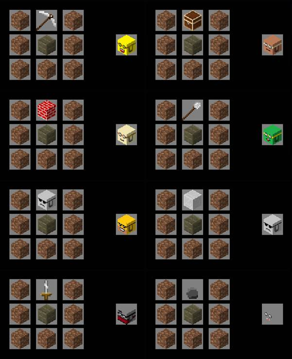

Some building plans for builder (will be explained further below):

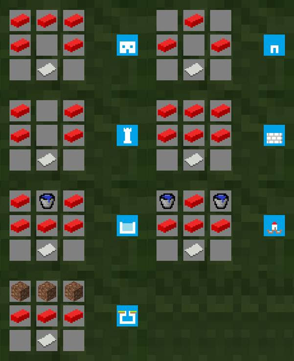

## GUIDE ON WORKERS

### A. Harvey The Harvester

Put it on the ground and right click. Enter the item name that you want it to collect (you can write in modname:nodename or alias).

Left click to activate, left click it again to stop it and take it and everything it has collected into your inventory.

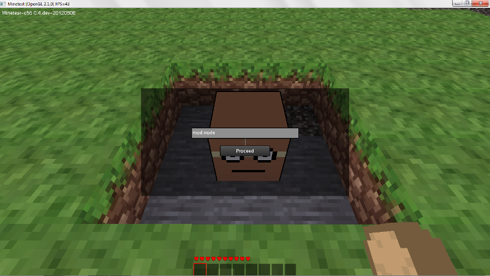

### B. Mordec The Miner

Put it on the ground and right click. Place some default:wood into the wood slot at top left corner.

Left click to activate, left click it again to stop it. For each level of ground it digs, it will consume one wood. Right click to open its inventory.

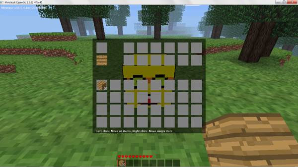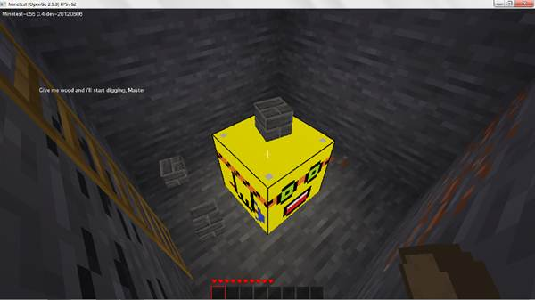

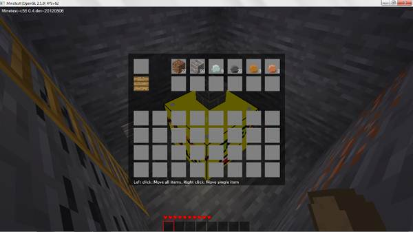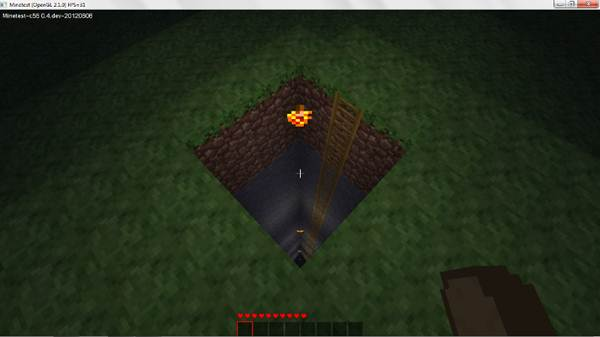

Mordec glows in the dark.

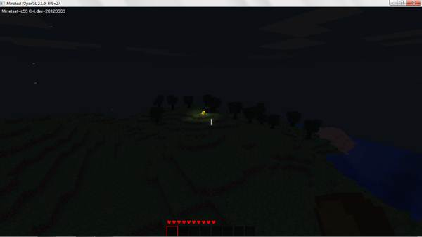

### C. Garren The Gardener

Put it on the ground and right click. Place one plant sample into the top left slot and put some default:sapling into the top right slot. Left click to activate, left click it again to stop it.

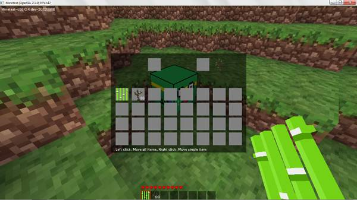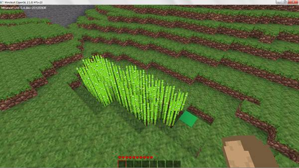

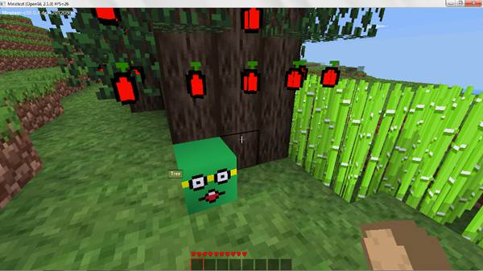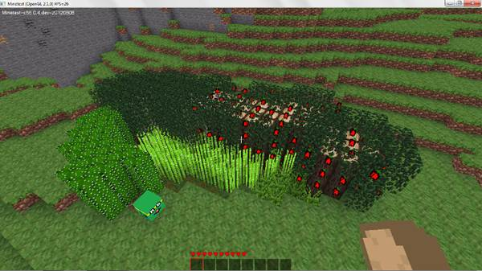

For each jungle tree it grows, it will consume 9 saplings.

For each apple tree, papyrus or cactus it grows, it will consume 3 saplings.

For each jungle grass or dry shrub it grows, it will consume one sapling.

If there is no plant sample or the sample is not one of the plants mentioned above, it will plant a sapling, and that of course will use one sapling each.

### D. Benjo The Builder

Put it on the ground and right click. Place a building plan into the top left slot and put any type* of material into the top right slot. Left click to start building.

After that, your plan will turn into blank paper.

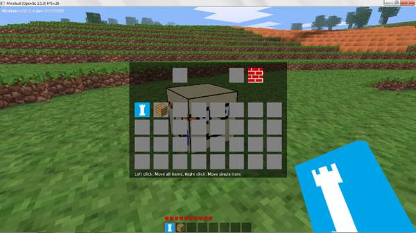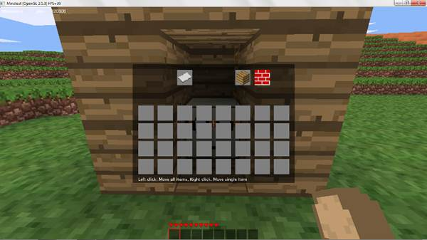

The building plans (refer further above for craft recipes):

1. House

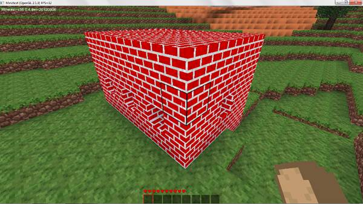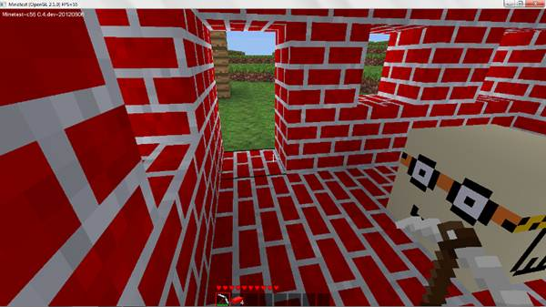

2. Hut

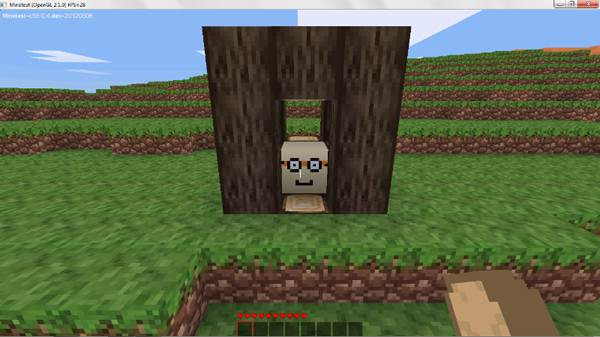

3. Tower

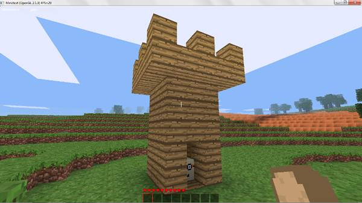

4. 9x9 wall

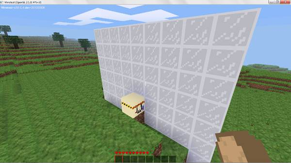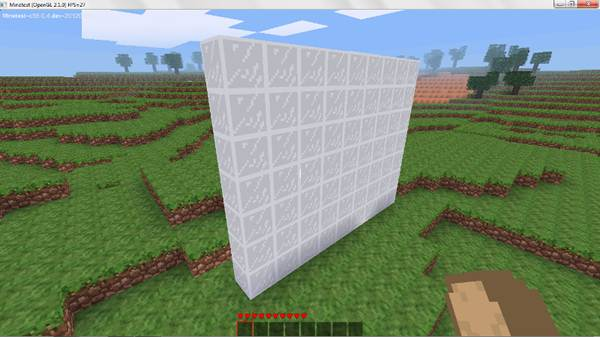

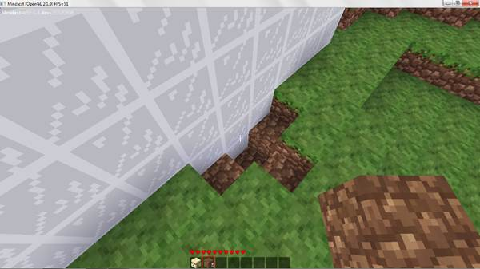

5. Underground bunker

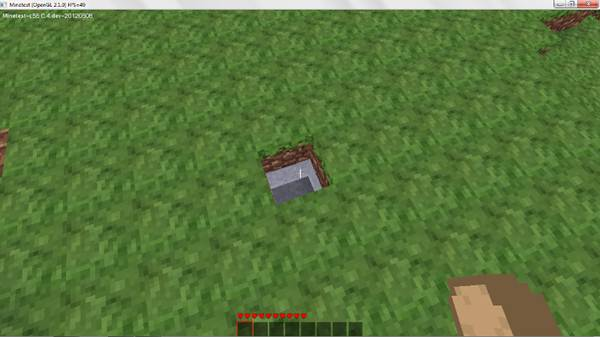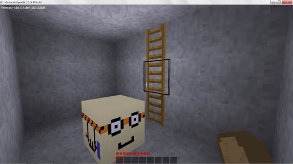

6. Pool

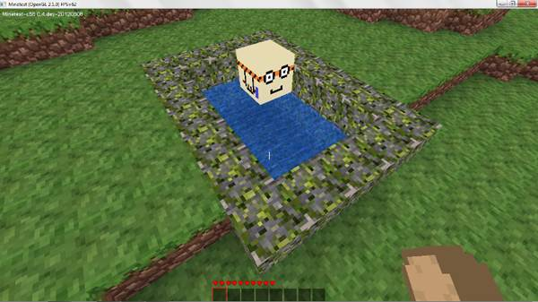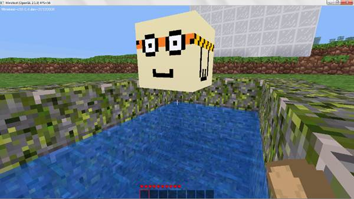

7. Moat

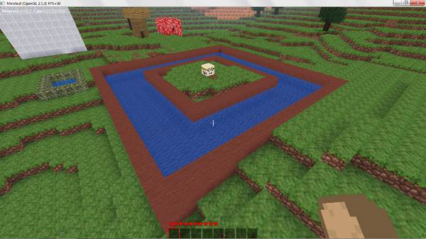

*All allowed materials are in default mod: stone, cobble, mossycobble, tree, jungletree, wood, brick, clay, desert stone, glass, steelblock, cactus and dirt.

**There are 2 more building plans which are not shown in this doc. Figure it out by yourself, it’s easy ;)

### E. Gredo The Guard

You only need to put it on the ground and let it catch any worker which enters its radius. The owner of the caught worker will be notified about the catch.

Only you (the owner of the guard) can take caught workers from its inventory.

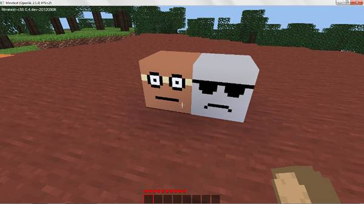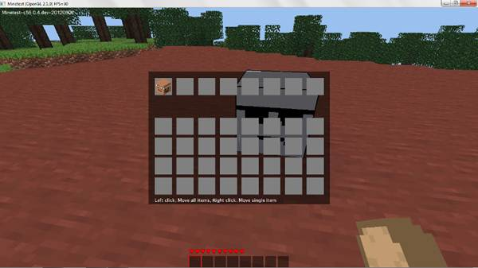

### F. Asvard The Assassin

Put it on the ground and right click. Enter player’s name which you want it to kill.

Left click to activate, left click it again to stop it.

It can wait for the targeted player to be online. Any guard within its radius will be annihilated.

Once it is stopped or completed its job, it will turn to steel sword.

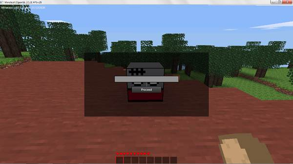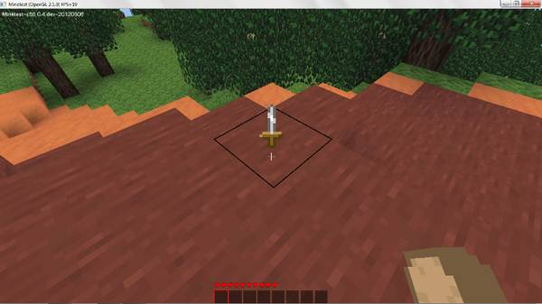

*It would not move if the targeted player is too far away (like _you-can’t-see-the-player_ far away).

### G. Toco The Thief

It is almost invisible and cannot be detected by guard or any workers above.

You only need to put it anywhere and let it steal everything inside locked chests and players’ inventory nearby.

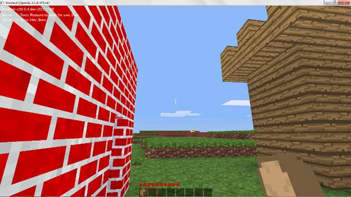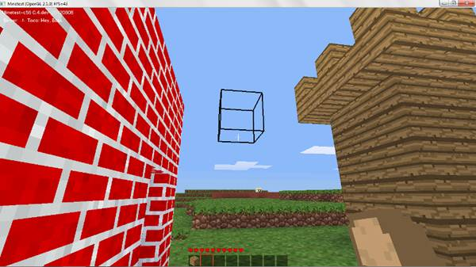

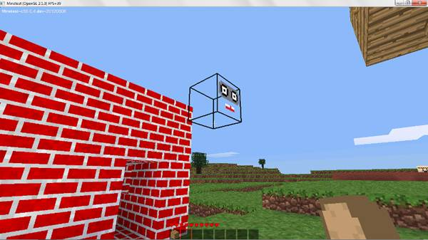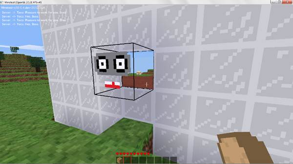

*Tips for its victim: Take your stuff back from him.

### H. Cardon The Cop

It’s the only worker so far that can beat assassin and thief. It can detect nearby thief and tell you its location and owner.

When it detects an assassin, it will destroy the assassin.

If the assassin has no target yet, then Cardon will give the owner a warning.

If it has a target, then Cardon will beat the owner and sends the owner to a prison high above him.

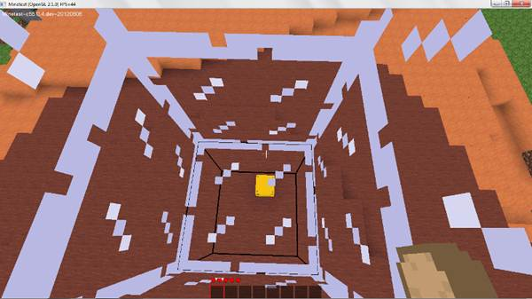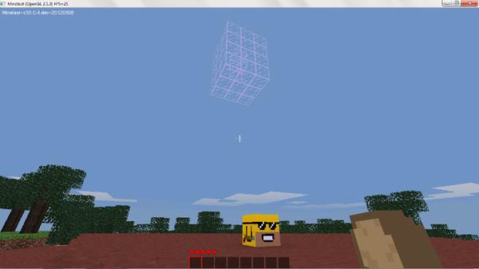

**END**
